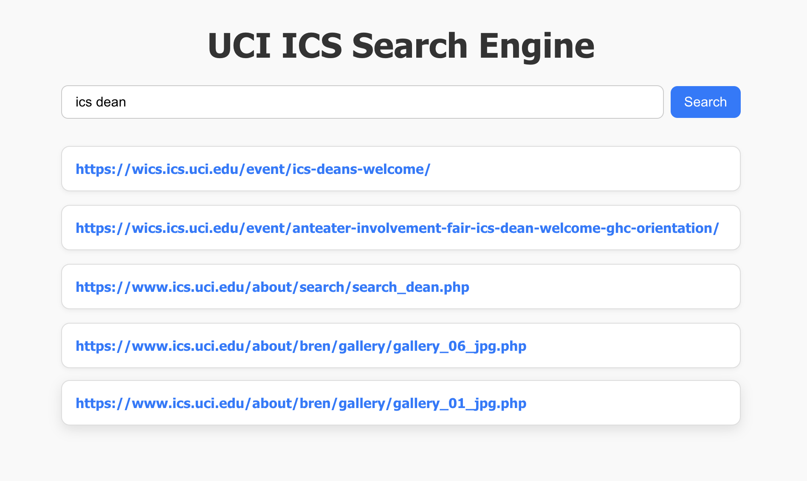

# ICS Search Engine

A full-featured search engine built from scratch, capable of indexing and querying tens of thousands of web pages under strict memory and performance constraints. Built as part of a course project at UC Irvine.

---

## Features

- **Inverted index** built entirely from scratch without search libraries (no Elasticsearch, Solr, etc.)
- **Porter stemming** for improved term matching across morphological variants
- **TF-IDF ranking** with cosine similarity normalization
- **Field-weighted scoring**: terms appearing in `<title>`, `<h1>`–`<h3>`, and `<b>` tags receive boosted weights
- **Disk-based index** with byte-offset lexicon for sub-300ms query response without loading the full index into memory
- **Partial index merging**: index is offloaded to disk in multiple passes and merged via a k-way heap merge
- **REST API** via Flask for web interface integration
- **Console search interface** with query timing

---

## Architecture

```
ICS Search Engine
├── index/
│   ├── index_builder.py     # Builds partial indexes and coordinates the pipeline
│   └── merge_indices.py     # K-way heap merge of partial indexes; builds lexicon + norms
├── search/
│   └── search_engine.py     # Query processing and ranked retrieval using byte-offset seeks
├── parser.py                # Loads JSON document files from the corpus
├── text_tokenizer.py        # HTML parsing, tokenization, and Porter stemming
├── web_ui/                  # React frontend
│   ├── src/                 # Components and search UI logic
│   ├── public/
│   └── package.json
│   └── package-lock.json
├── api.py                   # Flask REST API endpoint
├── main.py                  # Entry point: builds index and runs console search loop
└── data/                    # Generated at index time (not committed)
    ├── partial_index*.jsonl
    ├── inverted_index.jsonl
    ├── lexicon.json
    ├── doc_ids.json
    └── norms.json
```

---

## How It Works

### Indexing

1. Each document in the corpus is a JSON file containing a `url`, `content` (raw HTML), and `encoding`.
2. HTML is parsed with BeautifulSoup; tokens are extracted from visible text nodes, skipping `<script>`, `<style>`, and other non-content tags.
3. Each token is associated with the tag it came from (e.g. `h1`, `b`, `p`) to enable field-weighted scoring later.
4. Tokens are stemmed using the Porter stemmer.
5. The in-memory index is flushed to a partial index file on disk whenever memory usage exceeds a threshold (at least 3 times for large corpora), satisfying the operational constraint of never holding the full index in memory.
6. Partial indexes are merged using a **k-way min-heap merge** (similar to external merge sort), producing a single sorted JSONL index file.
7. During the merge, **TF-IDF scores** and **document L2 norms** are computed and stored. A **lexicon** (token → byte offset) is written to enable O(1) seeks into the index at query time.

### Ranking Formula

The score for a document given a query uses **cosine similarity** over TF-IDF vectors:

```
score(d, q) = (Σ tfidf_doc(t) * tfidf_query(t)) / (norm(d) * norm(q))
```

Where document TF is weighted by field importance:

| Field     | Weight |
|-----------|--------|
| `<title>` | 3.0×   |
| `<h1>`    | 2.5×   |
| `<h2>`    | 2.0×   |
| `<h3>`    | 1.5×   |
| `<b>`     | 1.2×   |
| Other     | 1.0×   |

### Querying

1. The query is lowercased, tokenized, and stemmed to match index terms.
2. For each query token, the lexicon provides a byte offset; the search engine seeks directly to that position in the index file —> **no full index load required**.
3. Cosine similarity scores are accumulated across query terms and the top-5 results are returned.

---

## Setup

### Requirements

- Python 3.10+

```bash
pip install -r requirements.txt
```

### Dataset

The corpus should be placed in a `DEV/` directory at the project root. Each subdirectory represents a domain, and each file within is a JSON document with the following structure:

```json
{
  "url": "https://example.ics.uci.edu/page",
  "content": "<html>...</html>",
  "encoding": "utf-8"
}
```

### Building the Index

```bash
python main.py
```

This will:
1. Walk all JSON files under `DEV/`
2. Build and flush partial indexes to `data/`
3. Merge them into `data/inverted_index.jsonl`
4. Write `data/lexicon.json`, `data/doc_ids.json`, and `data/norms.json`
5. Drop into a console search prompt

### Console Search

After indexing, you'll be prompted to enter queries:

```
Enter search query (blank to exit): machine learning
Search took 43.21 ms

Top results:
1. https://www.ics.uci.edu/...
2. https://ml.ics.uci.edu/...
...
```

### Web UI

To use the React frontend, start the API server first, then run the frontend in a separate terminal:

```bash
# Terminal 1: start the Flask API
python api.py

# Terminal 2: start the React frontend
cd web_ui
npm install      # first time only
npm run start
```

Then open `http://localhost:3000` in your browser. It should look like the following:



---

## Performance

| Metric | Result |
|---|---|
| Corpus size | ~55,000 web pages |
| Index spills to disk | ≥ 3 partial indexes |
| Merge strategy | K-way heap merge |
| Query response time | < 300ms (typically < 100ms) |
| Memory usage | Small, due to byte-offset seeks to index |

---

## Tech Stack

- **Python** — core implementation
- **BeautifulSoup4** — HTML parsing
- **NLTK** — tokenization and Porter stemming
- **Flask** — REST API
- **Pympler** — memory profiling for partial index flush decisions
